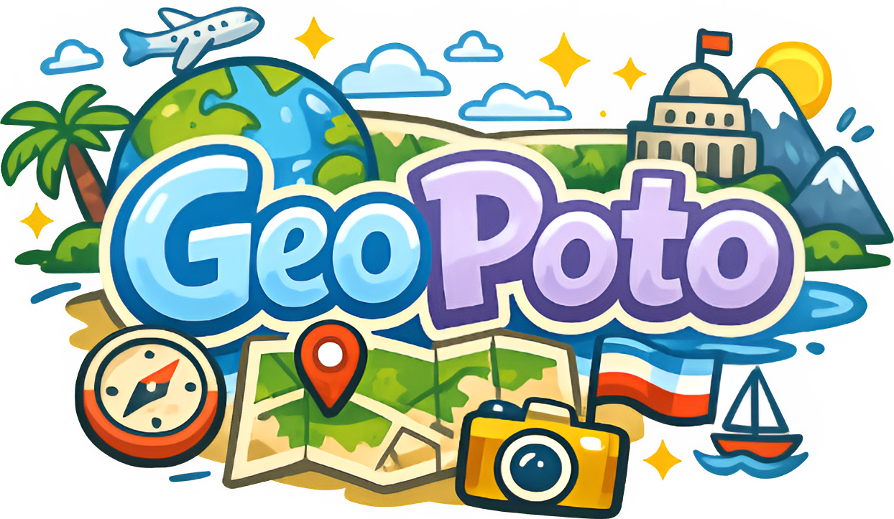

<div align="center">
  

  <h1>Geopoto</h1>

  <p>
    A fully offline mobile app for learning flags, capitals, countries and map positions through daily challenges, adaptive training and an interactive geography atlas.
  </p>

  <p>
    <a href="https://www.google.com">
      
    </a>
    <a href="https://www.google.com">
      
    </a>
  </p>
</div>

## About

Geopoto is built for people who want geographic knowledge to stick. It keeps the full learning experience offline, including generated country data, maps, flags, localized names and capitals.

The app combines quick practice sessions with a daily habit loop. Users can train on country names, capitals, flags and map positions, browse a learning encyclopedia, inspect an interactive world map and come back each day for a fresh challenge.

## Features

- **Offline geography data**: learn from 197 countries and flags without relying on a network connection.
- **Daily Challenge**: one shared geography puzzle per day with streak tracking and optional local reminders.
- **Adaptive training**: practice history stays on device and helps prioritize questions the user misses more often.
- **Custom quiz sessions**: choose regions, question formats, answer formats, flag answer difficulty, question limits and infinite mode.
- **Interactive map explorer**: pan, zoom, select countries and connect names with real map positions.
- **Learning encyclopedia**: browse countries, capitals and flags, with search and flag color filters.
- **Localized experience**: app UI and geographic names support English, French, German, Spanish, Italian and Portuguese.
- **Mobile native feel**: haptics, local notifications, dark mode, keyboard-aware layouts and smooth map rendering.

## Tech Stack

- [Expo](https://expo.dev/) SDK 55
- React Native 0.83
- Expo Router
- TypeScript
- React Native Skia for map rendering
- MMKV and SQLite for local storage
- i18next for localization
- pnpm workspaces and Turborepo

## Repository Structure

```text
.
├── apps
│   └── mobile          # Expo React Native app
├── packages
│   └── geo-data        # Generated country, flag and map data
├── stores
│   ├── content         # Store listing copy
│   └── screenshots     # Store screenshots
└── tooling             # Shared tooling packages
```

## Requirements

- Node.js
- pnpm 10.26.1
- Xcode for iOS development
- Android Studio for Android development

For native setup details, follow the Expo environment guide for custom development builds.

## Getting Started

Install dependencies from the repository root:

```bash
pnpm install
```

Start the Expo dev server:

```bash
pnpm start
```

Use the local or LAN variants when needed:

```bash
pnpm start:local
pnpm start:lan
```

## Native Builds

Geopoto uses `expo-dev-client`, so the first run on a simulator or device needs a native build.

Run iOS:

```bash
pnpm -C apps/mobile build:ios
```

Run Android:

```bash
pnpm -C apps/mobile build:android
```

After the first build, everyday JavaScript and TypeScript changes can usually use the dev server:

```bash
pnpm start
```

Rebuild the native app after changing native dependencies, Expo config, notification settings, app icons or build properties.

## Quality Checks

Run the full project check:

```bash
pnpm check
```

Run individual checks:

```bash
pnpm lint
pnpm format
pnpm typecheck
pnpm test
```

Apply formatting fixes:

```bash
pnpm format:fix
```

## Store Content

Localized store listing drafts live in:

```text
stores/content
```

The current store button links in this README are placeholders and should be replaced once the App Store and Google Play pages are available.
